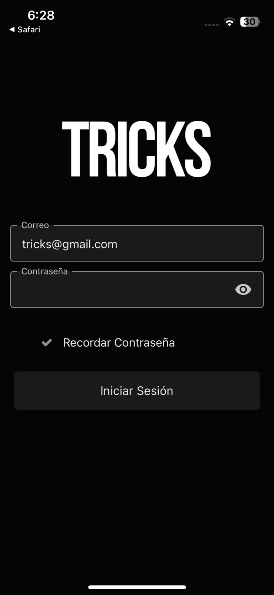
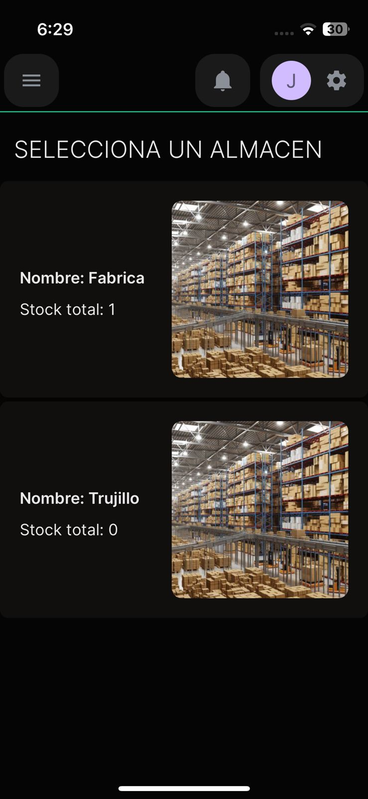
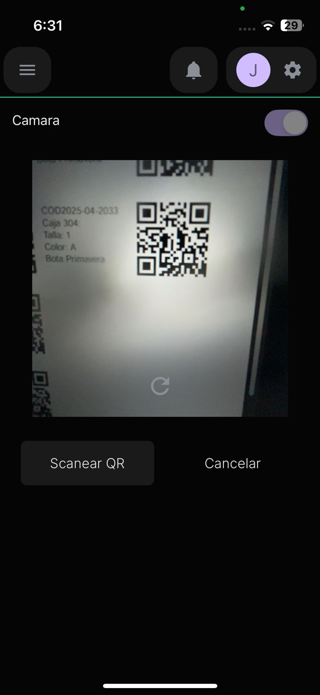
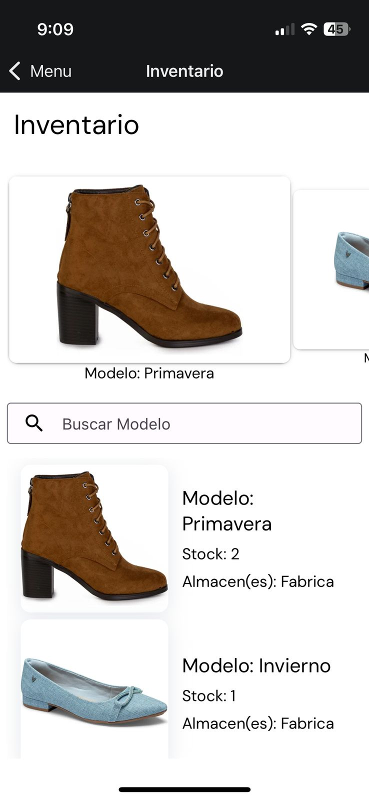
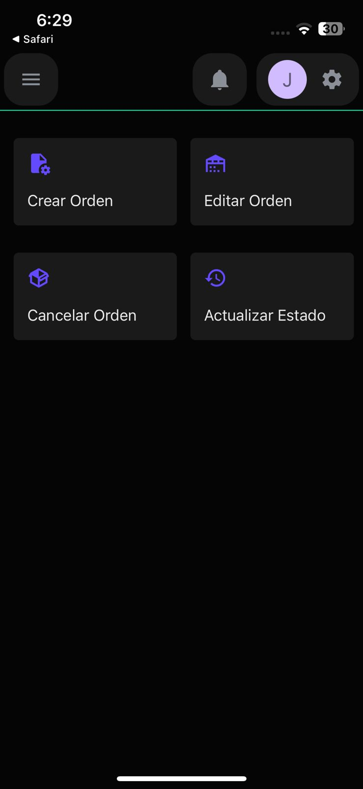
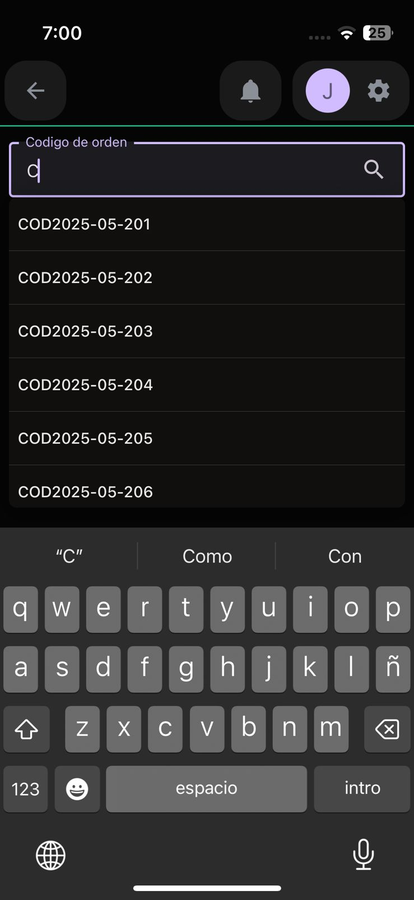
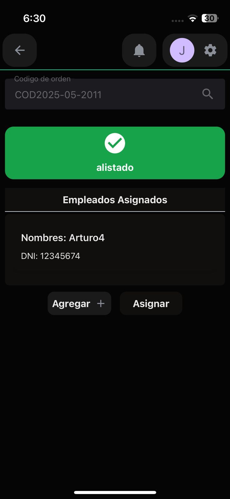
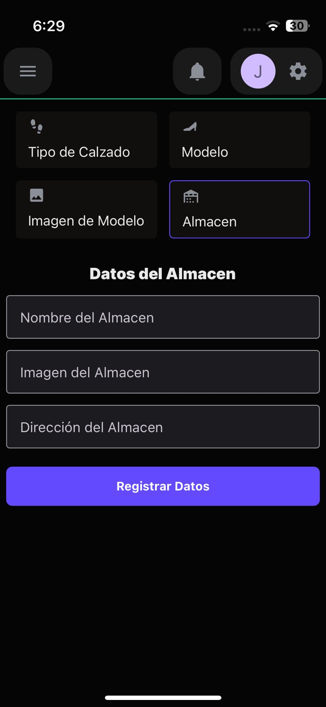

# 👠 TRICKS App — Gestión de Calzado Femenino

Aplicación móvil para la **gestión de stock, órdenes de producción y pedidos** en una tienda de calzado de dama. Este sistema permite a los usuarios tener **control total sobre almacenes, inventarios y procesos de producción** desde su dispositivo móvil.

---

## 🚀 Tecnologías Usadas

- **React Native**
- **NativeWind**
- **Expo**
- **Node.js**
- **Express**
- **JavaScript**

---

## 🧾 Funcionalidades Principales

### 🔐 Etapa 1: Login
- Inicio de sesión con correo y contraseña.
- Opción para recordar la contraseña.
- Redirección a la pantalla principal tras autenticarse.

### 🧭 Menú Principal
Desde el menú principal, el usuario puede navegar entre las siguientes secciones:

---

### 🏭 Órdenes de Producción
- Crear nuevas órdenes.
- Editar órdenes existentes.
- Cancelar órdenes.
- Actualizar el estado de una orden:
  - Pendiente
  - En Proceso
  - Finalizada
  - Cancelada
  - Vencida

### 🏬 Almacenes
- Realizar ingresos o salidas de productos.
- Visualizar y seleccionar almacenes específicos.
- Ver detalles de cada almacén.

### 📦 Inventario
- Ver el stock general de calzado disponible.
- Mostrar el stock por modelo.
- Ver distribución por almacenes.

### 🧾 Historial de Pedidos
- Ver historial detallado de pedidos.
- Filtros por estado:
  - Pendientes
  - En Proceso
  - Completadas
  - Canceladas
  - Vencidas

---

## 📸 Capturas de Pantalla

### 🔐 Login y Navegación
| Login | Menú Principal | Usuario |
|-------|----------------|---------|
|  |  |  |

---

### 🏬 Almacenes e Inventario
| Almacenes | Detalle de Almacén | Ingresos y Salidas |
|-----------|---------------------|---------------------|
|  |  |  |

#### Inventario General

  

---

### 🏭 Órdenes de Producción
| Crear Orden | Actualizar Orden 1 | Actualizar Orden 2 | Actualizar Orden 3 |
|-------------|---------------------|---------------------|---------------------|
|  |  |  |  |

---

### 📜 Historial y Datos
| Historial de Pedidos | Crear Datos en la BD | Crear Cliente |
|----------------------|-----------------------|----------------|
|  |  |  |

---

