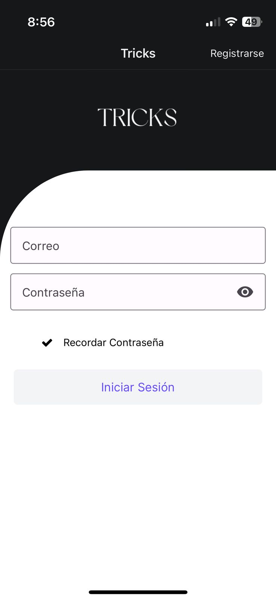
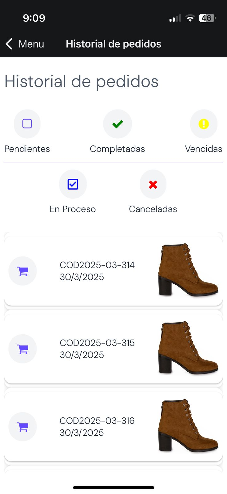

# Welcome to Tricks app 👋 

# TRICKS 👠 

Aplicación móvil para la gestión de stock, órdenes de producción y pedidos en una tienda de calzado de dama. Este sistema permite a los usuarios tener control total sobre los almacenes, inventarios y procesos de producción desde su dispositivo móvil.

## 🚀 Tecnologías Usadas

- **React Native**
- **NativeWind**
- **Expo**
- **Node.js**
- **Express**
- **JavaScript**

---

## 🧾 Funcionalidades Principales

### 🔐 Etapa 1: Login
- Inicio de sesión con correo y contraseña.
- Opción para recordar la contraseña.
- Redirección a la pantalla principal tras autenticarse.

---

### 🧭 Menú Principal
Desde el menú principal, el usuario puede navegar entre las siguientes secciones:

### 🏭 Órdenes de Producción
- Crear nuevas órdenes.
- Editar órdenes existentes.
- Cancelar órdenes.
- Actualizar el estado de una orden (Pendiente, En Proceso, Finalizada, Cancelada, Vencida).

### 🏬 Almacenes
- Realizar ingresos o salidas de productos.
- Visualizar y seleccionar almacenes específicos.

### 📦 Inventario
- Ver el stock general de calzado disponible.
- Mostrar el stock por modelo y su distribución en los diferentes almacenes.

### 📜 Historial de Pedidos
- Ver historial detallado de pedidos.
- Filtros por estado:
  - Pendientes
  - En proceso
  - Completadas
  - Canceladas
  - Vencidas

---

## 📱 Capturas de Pantalla

| Login                          | Inventario                      | Historial de Pedidos             |
|-------------------------------|----------------------------------|----------------------------------|
|   |  |  |

---

## 📁 Estructura del Proyecto

